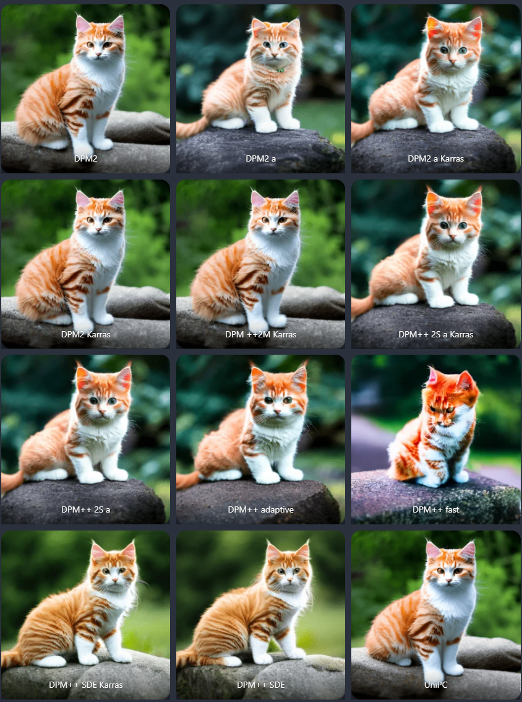

# Pour aller plus loin

Cette page explore des concepts plus techniques pour ceux qui souhaitent approfondir leur compréhension des modèles de diffusion.

---

## Convergence et Samplers

Le choix de l'algorithme (Sampler) détermine si l'image va se stabiliser ("converger") ou continuer à évoluer sans fin à chaque étape supplémentaire.

| Euler (Convergent) | Euler Ancestral (Non-Convergent) |
| :---: | :---: |
|  |  |

*Observation : Les deux exemples utilisent 40 steps. À gauche, **Euler** stabilise l'image. À droite, **Euler Ancestral (Euler a)** continue d'ajouter du bruit à chaque étape, ce qui empêche une convergence totale et fait "bouger" continuellement les détails.*

---

## Les Samplers : Euler vs Euler Ancestral

Le choix de l'algorithme d'échantillonnage (Sampler) influence la façon dont l'image évolue.

*   **Euler :** Un échantillonneur "déterministe". Plus vous ajoutez de steps, plus l'image se stabilise vers un résultat fixe.
*   **Euler Ancestral (Euler a) :** Un échantillonneur "stochastique". Il ajoute un peu de bruit à chaque étape, ce qui signifie que le résultat peut continuer à changer radicalement même avec beaucoup de steps.

---

## Pourquoi le Transformer ?

Les nouveaux modèles comme **Flux** ou **Stable Diffusion 3** remplacent les blocs de convolution par des blocs **Transformer** (Similaire à GPT).

*   **Avantage :** Une meilleure compréhension des structures complexes et une meilleure relation entre les mots du prompt et les objets dans l'image (Prompt Adherence).
*   **Performance :** Bien que plus gourmands, ils permettent d'atteindre un niveau de détail et de cohérence spatiale bien supérieur.
