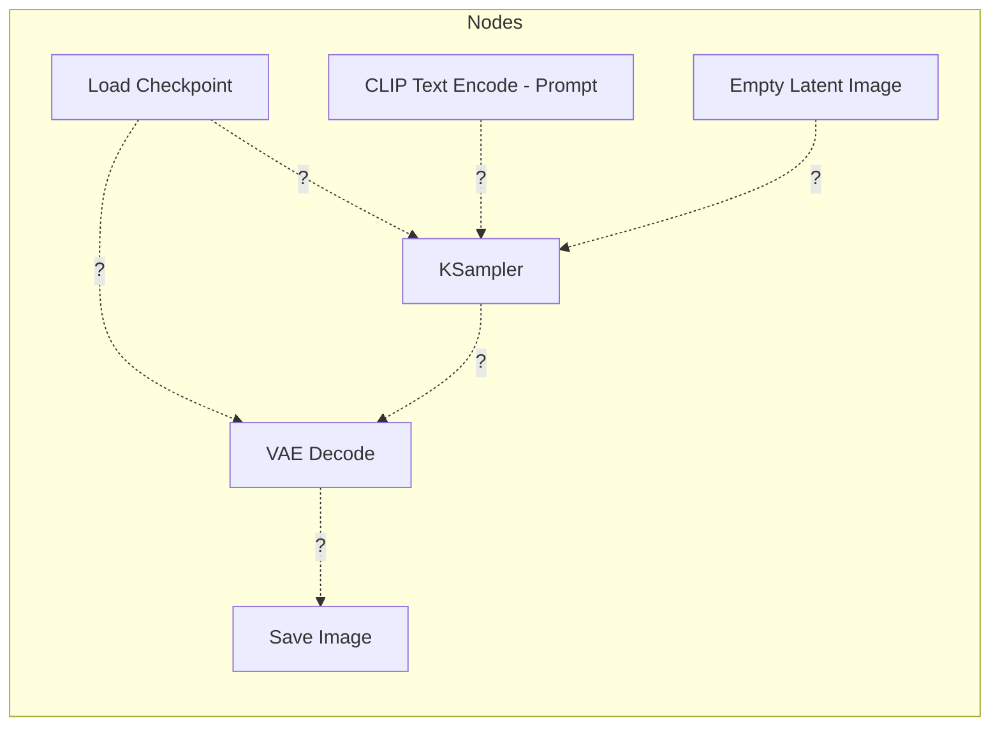

# ComfyUI: Thinking in Nodes

Welcome to the "Boss Level." **ComfyUI** is a node-based interface. Instead of simple buttons, you see the actual "piping" of the AI.

---

## 🏗️ The Anatomy of a Workflow

In ComfyUI, every action is a "Node." To make an image, data must flow from the model through several steps until it becomes pixels.

### The Basic Blocks:
1.  **Load Checkpoint:** Loads the AI model.
2.  **CLIP Text Encode:** Turns your prompt into numbers the AI understands.
3.  **Empty Latent Image:** Creates the "blank canvas" of noise.
4.  **KSampler:** The engine that does the denoising.
5.  **VAE Decode:** Converts the result from "math" (Latent) to "pixels" (Image).

---

## 🧩 Challenge: Connect the Dots

Below is a diagram of a standard workflow, but the **connections are missing**. 

### The Puzzle
Imagine you are looking at your screen. You have these five nodes, but they aren't talking to each other. **Can you figure out where the wires go?**

### 📝 Your Task:
Open ComfyUI and try to recreate this. Here is the logic you need to follow:
1.  The **MODEL** output from "Load Checkpoint" needs to go into the KSampler.
2.  The **CONDITIONING** output from your Prompt needs to go into the "positive" slot of the KSampler.
3.  The **LATENT** output from "Empty Latent" provides the starting noise for the KSampler.
4.  The **LATENT** result from the KSampler must be **DECODED** by the VAE.
5.  The **VAE** itself comes from the "Load Checkpoint" node!

!!! warning "Common Mistake"
    Forget to connect the **VAE** from the "Load Checkpoint" to the "VAE Decode" node, and you'll get an error. The AI needs that specific VAE to "translate" the latent space back to colors!

---

## 🎯 Final Goal
Once you connect these correctly, press **"Queue Prompt"**. If a beautiful image pops out of the "Save Image" node, you've successfully built your first AI engine!

---

## 📚 Summary
You've learned:
- How Diffusion works (Denoising).
- How to use a simple UI (LightDiffusion-Next).
- How to build a custom engine (ComfyUI).

**Happy generating!**
