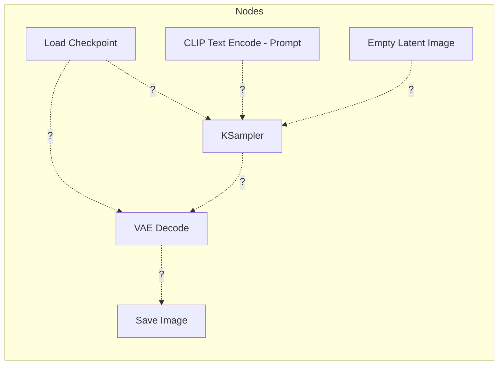

# ComfyUI : Penser en Nœuds

Bienvenue au "Niveau Boss". **ComfyUI** est une interface nodale. Au lieu de simples boutons, vous voyez la "tuyauterie" réelle de l'IA.

---

## 🏗️ Anatomie d'un Flux de Travail (Workflow)

Dans ComfyUI, chaque action est un "Nœud". Pour créer une image, les données doivent circuler du modèle à travers plusieurs étapes jusqu'à devenir des pixels.

### Les Blocs de Base :
1.  **Load Checkpoint :** Charge le modèle d'IA.
2.  **CLIP Text Encode :** Transforme votre texte en nombres compréhensibles par l'IA.
3.  **Empty Latent Image :** Crée le "canevas vide" de bruit.
4.  **KSampler :** Le moteur qui effectue le débruitage.
5.  **VAE Decode :** Convertit le résultat des "maths" (Latent) en "pixels" (Image).

---

## 🧩 Défi : Reliez les Points

Ci-dessous se trouve un diagramme d'un workflow standard, mais les **connexions sont manquantes**.

### L'Énigme
Imaginez que vous regardez votre écran. Vous avez ces cinq nœuds, mais ils ne communiquent pas entre eux. **Pouvez-vous deviner où vont les câbles ?**

### 📝 Votre Mission :
Ouvrez ComfyUI et essayez de recréer ceci. Voici la logique à suivre :
1.  La sortie **MODEL** du nœud "Load Checkpoint" doit aller dans le KSampler.
2.  La sortie **CONDITIONING** de votre Prompt doit aller dans l'entrée "positive" du KSampler.
3.  La sortie **LATENT** de "Empty Latent" fournit le bruit de départ au KSampler.
4.  Le résultat **LATENT** du KSampler doit être **DÉCODÉ** par le VAE.
5.  Le **VAE** lui-même provient du nœud "Load Checkpoint" !

!!! warning "Erreur Courante"
    Oublier de connecter le **VAE** du nœud "Load Checkpoint" vers le nœud "VAE Decode" provoquera une erreur. L'IA a besoin de ce VAE spécifique pour "traduire" l'espace latent en couleurs !

!!! tip "Astuce de Pro : Le bruit n'est pas votre ennemi"
    Dans le nœud **Empty Latent Image**, essayez de changer la taille à `64x64` tout en gardant une sortie finale en `512x512`. Vous verrez l'IA essayer de transformer de gros blocs de couleur en objets détaillés. C'est le secret pour créer des compositions artistiques abstraites !

---

## 🎯 Objectif Final
Une fois que vous avez tout connecté correctement, appuyez sur **"Queue Prompt"**. Si une magnifique image sort du nœud "Save Image", vous avez réussi à construire votre premier moteur d'IA !

---

## 📚 Résumé
Vous avez appris :
- Comment fonctionne la Diffusion (Débruitage).
- Comment utiliser une interface simple (LightDiffusion-Next).
- Comment construire un moteur personnalisé (ComfyUI).

**Bonne génération !**