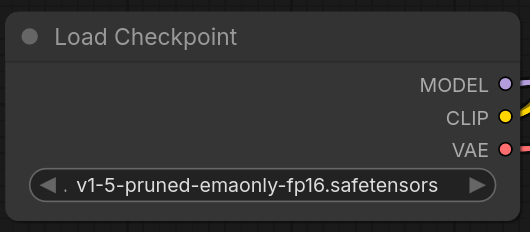
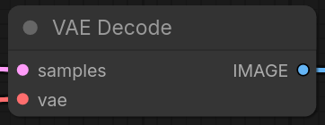
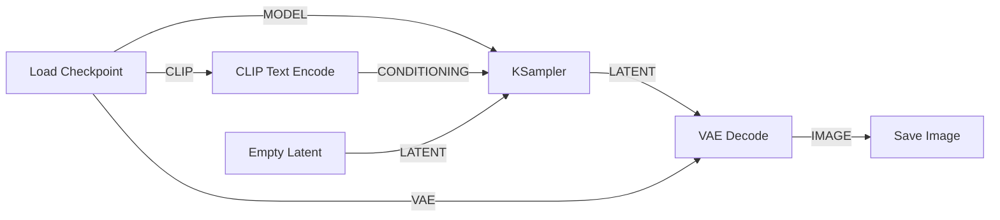

# Module 2 : Architecture nodale avec ComfyUI

ComfyUI est une interface basée sur des graphes de nœuds. Elle permet de visualiser et de manipuler directement le flux de données (workflow). Cette approche est indispensable pour comprendre comment les composants communiquent entre eux.

---

## Terminologie technique

*   **Nœud (Node) :** Unité de traitement effectuant une opération spécifique (encodage, échantillonnage, décodage).
*   **Liaison (Noodle/Edge) :** Connexion transportant un type de donnée spécifique (Model, Clip, Latent, VAE).
*   **Workflow :** L'ensemble du graphe constituant la pipeline de génération.

---

## Les composants du workflow standard

!!! info "1. Load Checkpoint"
    C'est le point d'entrée qui charge les poids du modèle. Il distribue les données vers trois flux :
    *   **MODEL :** Transmis au KSampler.
    *   **CLIP :** Transmis aux encodeurs de texte.
    *   **VAE :** Transmis au décodeur final.

    

!!! info "2. CLIP Text Encode"
    Transforme le texte brut en données compréhensibles par le modèle. Ces données servent de "guide" (Conditioning) au processus de débruitage.

    

!!! info "3. Empty Latent Image"
    Définit les dimensions de sortie et génère le bruit initial dans l'espace latent. L'image n'existe pas encore sous forme de pixels à cette étape.

    

!!! info "4. KSampler"
    Le moteur de calcul. Il reçoit le modèle, les prompts (positif/négatif) et le bruit latent. Il effectue les itérations de débruitage demandées.

    

!!! info "5. VAE Decode"
    Prend les données mathématiques en sortie du KSampler et utilise le module VAE pour les traduire en pixels affichables.

    

---

## Exercice : Reconstitution du flux

!!! warning "Objectif du module"
    Dans cet exercice, vous disposez des nœuds nécessaires sur votre canevas, mais les liaisons sont rompues. Vous devez reconnecter les flux en respectant la logique de transport des données.

**Schéma logique de connexion :**

!!! tip "Raccourcis d'interface"
    *   **Double-clic :** Ouverture de la recherche rapide de nœuds.
    *   **Clic droit sur une entrée :** Permet de convertir un paramètre (ex: seed) en entrée connectable.
    *   **Glisser-déposer depuis un port :** Propose automatiquement les nœuds compatibles avec le type de donnée.

---

## Synthèse de l'atelier

À l'issue de ces modules, vous devriez être en mesure d'identifier chaque étape de la création d'une image : de l'intention textuelle au traitement mathématique dans l'espace latent, jusqu'au décodage final.