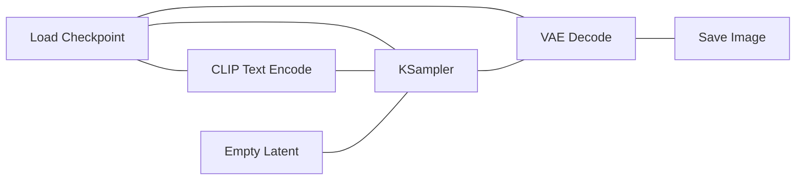
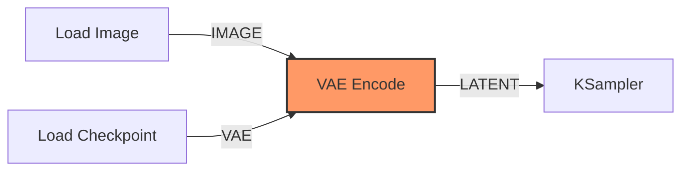

# Module 2 : Architecture nodale avec ComfyUI

ComfyUI est une interface basée sur des graphes de nœuds. Elle permet de visualiser et de manipuler directement le flux de données (workflow). Cette approche est indispensable pour comprendre comment les composants communiquent entre eux.

---

## Terminologie technique

*   **Nœud (Node) :** Unité de traitement effectuant une opération spécifique (encodage, échantillonnage, décodage).
*   **Liaison (Noodle/Edge) :** Connexion transportant un type de donnée spécifique (Model, Clip, Latent, VAE).
*   **Workflow :** L'ensemble du graphe constituant la pipeline de génération.

---

## Les composants du workflow standard

!!! info "1. Load Checkpoint"

    C'est le point d'entrée qui charge les poids du modèle. Il distribue les données vers trois flux :

    *   **MODEL :** Transmis au KSampler.
    *   **CLIP :** Transmis aux encodeurs de texte.
    *   **VAE :** Transmis au décodeur final.

    { .center-img }

!!! info "2. CLIP Text Encode"

    Transforme le texte brut en données compréhensibles par le modèle. Ces données servent de "guide" (Conditioning) au processus de débruitage.

    { .center-img }

!!! info "3. Empty Latent Image"

    Définit les dimensions de sortie et génère le bruit initial dans l'espace latent. L'image n'existe pas encore sous forme de pixels à cette étape.

    { .center-img }

!!! info "4. KSampler"

    Le moteur de calcul. Il reçoit le modèle, les prompts (positif/négatif) et le bruit latent. Il effectue les itérations de débruitage demandées.

    { .center-img }

!!! info "5. VAE Decode"

    Prend les données mathématiques en sortie du KSampler et utilise le module VAE pour les traduire en pixels affichables.

    { .center-img }

---

## Exercice : Le Puzzle Logique

!!! warning "Objectif"

    Dans cet exercice, vous disposez des nœuds nécessaires sur votre canevas, mais les **câbles sont coupés** ! Vous devez reconnecter les flux en respectant la logique de transport des données. Utilisez les couleurs des ports pour vous guider.

??? success "Voir la solution (Workflow complet)"

    N'ouvrez ce bloc que si vous êtes bloqué ou pour vérifier votre travail.
    
    { .center-img }

---

## Astuces de Pro (Shortcuts)

Pour manipuler le puzzle comme un expert :

*   **Recherche rapide :** Double-cliquez n'importe où sur le fond pour ouvrir le menu de recherche.
*   **Clonage :** Maintenez **ALT** et faites glisser un nœud pour le dupliquer.
*   **Aide au branchement :** Tirez un câble depuis un point de sortie et lâchez-le dans le vide ; ComfyUI vous proposera uniquement les nœuds compatibles.

---

## [BONUS] Le Puzzle Inversé : img2img

Si vous avez terminé le premier puzzle, essayez de comprendre comment transformer une image existante au lieu de partir d'un canevas vide.

!!! fastforward "Le concept img2img"

    Dans un flux **img2img**, on remplace le nœud **Empty Latent Image** par un duo :

    1.  **Load Image** : Pour charger votre fichier.
    2.  **VAE Encode** : Pour transformer vos pixels en "Latent" (le langage de l'IA).

**Défi :** Dans ComfyUI, essayez d'ajouter ces deux nœuds et de les connecter au KSampler. 

!!! tip "Réglages recommandés"

    *   **Prompt de départ** : "A beautiful oil painting, hyper-detailed, masterpiece"
    *   **Sampler** : Utilisez `kl_optimal` pour un résultat fluide.
    *   **Denoise** : Commencez à **0.65**. C'est le "sweet spot" pour transformer l'image tout en gardant la structure originale.

---

## Synthèse
À l'issue de ces modules, vous avez "ouvert la boîte noire". Vous savez maintenant que l'IA ne crée pas d'image ex-nihilo, mais qu'elle sculpte un espace mathématique (Latent) guidée par vos mots (CLIP) et traduite par un décodeur (VAE).