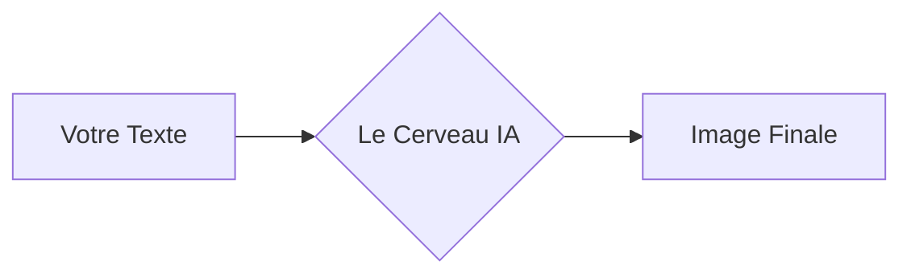

# Atelier : Architecture de la Diffusion

La majorité des outils d'IA génératrice d'images (Midjourney, ChatGPT, DALL-E) masquent la complexité technique derrière une simple barre de texte. Cet atelier propose d'ouvrir la "boîte noire" pour comprendre les mécanismes fondamentaux qui permettent à une machine de transformer des données numériques en images.

---

## Le Chemin de la Donnée

Dans cet atelier, nous allons suivre le parcours d'une idée, de votre texte jusqu'aux pixels de l'image finale.

---

## Les Concepts de Base

### 1. Le Débruitage (Denoising)
La génération d'images par diffusion repose sur un processus de réduction du bruit. L'IA ne "dessine" pas au sens traditionnel ; elle sculpte une information à partir d'un chaos de pixels aléatoires.

!!! info "Évolution : Le Diffusion Transformer (DiT)"
    Les modèles les plus modernes (comme Flux ou Sora) utilisent une architecture de type **Transformer**. Cela permet à l'IA de mieux comprendre la structure globale de l'image, un peu comme ChatGPT comprend la structure d'une phrase.

!!! info "Le concept de 'Noodles'"
    Dans le monde de l'IA nodale (ComfyUI), on appelle les câbles de liaison des **Noodles**. Chaque noodle transporte une information précise : le texte, la structure ou les couleurs.

    
    Visualisation de l'émergence d'une forme à travers les étapes de débruitage.

---

## Les Trois Piliers

Pour comprendre comment l'image est créée, nous allons manipuler trois composants :

!!! abstract "L'Espace Latent"
    C'est un espace de travail compressé où l'IA calcule l'image. Imaginez une "esquisse mathématique" invisible avant d'être transformée en pixels.

!!! abstract "Le Guidage (Conditioning)"
    Le texte que vous saisissez sert de guide. Il oriente l'IA pour que le bruit se transforme en ce que vous avez demandé.

!!! abstract "Le VAE (Le Traducteur)"
    C'est l'outil qui traduit les calculs invisibles de l'espace latent en une image réelle que nous pouvons voir.

---

## Structure de l'atelier

L'apprentissage est divisé en deux modules :

1.  **Validation des paramètres :** Utilisation de l'interface simplifiée **LightDiffusion** pour tester les réglages de base (Seed, Steps, CFG).
2.  **Architecture nodale :** Passage sur **ComfyUI** avec une approche **"Puzzle"**. Vous devrez reconnecter vous-mêmes les composants pour comprendre le chemin des données.

[Accéder au Module 1 : LightDiffusion &rarr;](light-diffusion.md)