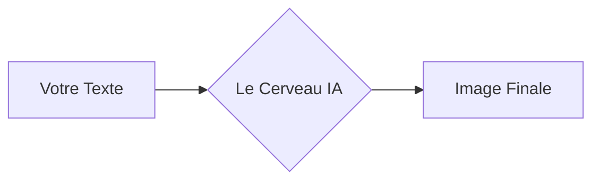
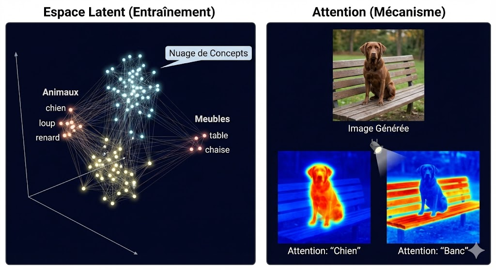

# Atelier : Architecture de la Diffusion

La majorité des outils d'IA génératrice d'images (Midjourney, ChatGPT, DALL-E) masquent la complexité technique derrière une simple barre de texte. Cet atelier propose d'ouvrir la "boîte noire" pour comprendre les mécanismes fondamentaux qui permettent à une machine de transformer des données numériques en images.

---

## Le Chemin de la Donnée

Dans cet atelier, nous allons suivre le parcours d'une idée, de votre texte jusqu'aux pixels de l'image finale.

---

## Les Concepts de Base

### 1. Le Débruitage (Denoising)
La génération d'images par diffusion repose sur un processus de réduction du bruit. L'IA ne "dessine" pas au sens traditionnel ; elle sculpte une information à partir d'un chaos de pixels aléatoires.

!!! info "Le processus en action"
    

    
    

    *Visualisation de l'émergence d'une forme à travers les étapes de débruitage.*

### 2. Entraînement et Nuage de Concepts
Durant sa phase d'apprentissage, l'IA n'apprend pas par cœur des images, mais des relations statistiques entre des mots et des formes. Elle crée un **nuage de concepts** dans un espace multidimensionnel.

*   **Proximité sémantique :** Les concepts proches (ex: "chien" et "loup") sont regroupés géographiquement.
*   **Navigation :** Générer une image revient à demander à l'IA de se déplacer vers une coordonnée précise de ce nuage.

---

## Les Composants Techniques

### 1. L'Espace Latent
C'est un espace de travail compressé où l'IA calcule l'image. Le **VAE (Variational AutoEncoder)** est l'outil qui compresse le monde réel en "latents" et les décompresse en pixels visibles.

### 2. Le Guidage et l'Attention
Le texte que vous saisissez est converti en vecteurs par **CLIP**. Le **mécanisme d'attention** permet ensuite à l'IA de focaliser ses calculs sur des zones spécifiques de l'image en fonction des mots du prompt.

*   **Exemple :** Le mot "chauve" activera une attention forte sur le sommet du crâne, tandis que "papiers" dirigera le calcul vers les objets tenus en main.

---

## Structure de l'atelier

L'apprentissage est divisé en deux modules :

1.  **Validation des paramètres :** Utilisation de l'interface simplifiée **LightDiffusion** pour tester les réglages de base (Seed, Steps, CFG).
2.  **Architecture nodale :** Passage sur **ComfyUI** avec une approche **"Puzzle"**. Vous devrez reconnecter vous-mêmes les composants pour comprendre le chemin des données.

[Accéder au Module 1 : LightDiffusion &rarr;](light-diffusion.md)
