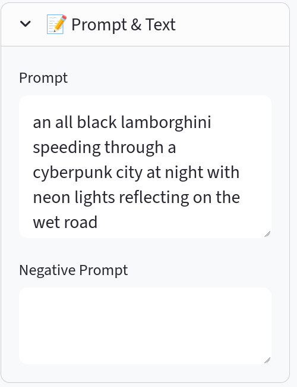
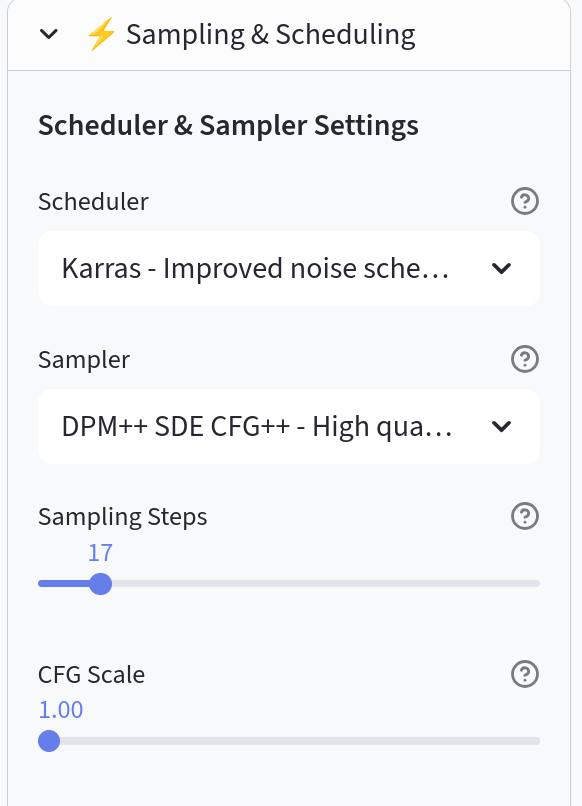

# Module 1 : Validation des concepts de base

Cette première phase utilise l'interface **LightDiffusion-Next**. L'objectif est de valider les connaissances théoriques en observant l'impact direct des paramètres de génération.

---

## Paramètres de contrôle

Trois variables fondamentales permettent de piloter la génération.

!!! success "Le Prompt (Conditioning)"
    C'est la directive textuelle. L'IA interprète vos mots pour orienter le débruitage.

    *   **Positif :** Les éléments à inclure.
    *   **Négatif :** Les éléments ou styles à exclure explicitement.
    
    { .center-img }

!!! success "Le Sampling (Steps)"
    Le nombre d'itérations que l'IA effectue pour retirer le bruit. 

    *   **Observation :** Un nombre trop faible laisse l'image inachevée. Un nombre trop élevé s'avère souvent inefficace passé un certain point de convergence.
    
    { .center-img }

!!! success "La Seed (Déterminisme)"
    La Seed est la valeur numérique qui initialise le bruit de départ. 

    *   **Fixe :** Permet de reproduire exactement la même image.
    *   **Aléatoire (-1) :** Produit un nouveau point de départ à chaque génération.

!!! success "Le CFG Scale (Fidélité au Prompt)"
    Le **Classifier Free Guidance** contrôle l'équilibre entre la créativité de l'IA et le respect strict de vos instructions.

    *   **Valeur basse (1-3) :** L'IA est très libre, les couleurs sont souvent délavées.
    *   **Valeur standard (7-9) :** Le compromis idéal.
    *   **Valeur haute (15+) :** L'IA force les traits, les contrastes deviennent extrêmes.

---

## Exercices d'application

!!! note "Consignes de test"
    Pour chaque exercice, utilisez le modèle **SD1.5** qui vous est fourni dans le sélecteur.
    
    1.  **Stabilité :** Générez une image, notez sa Seed, puis relancez. Observez la reproduction.
    2.  **Variabilité :** Modifiez un seul adjectif dans votre prompt tout en conservant la même Seed.
    3.  **L'effet CFG :** Avec une Seed fixe, comparez une génération à CFG 1.0, 7.0 et 30.0.
    4.  **Convergence :** Observez la différence de netteté entre 15 et 30 steps.

---

[Accéder au Module 2 : Architecture nodale (ComfyUI) &rarr;](comfyui.md)

??? tip "Pour aller plus loin"
    Si vous voulez comprendre les différences plus subtiles entre les algorithmes (Samplers) ou visualiser la convergence en temps réel, consultez la page [Pour aller plus loin](advanced.md).